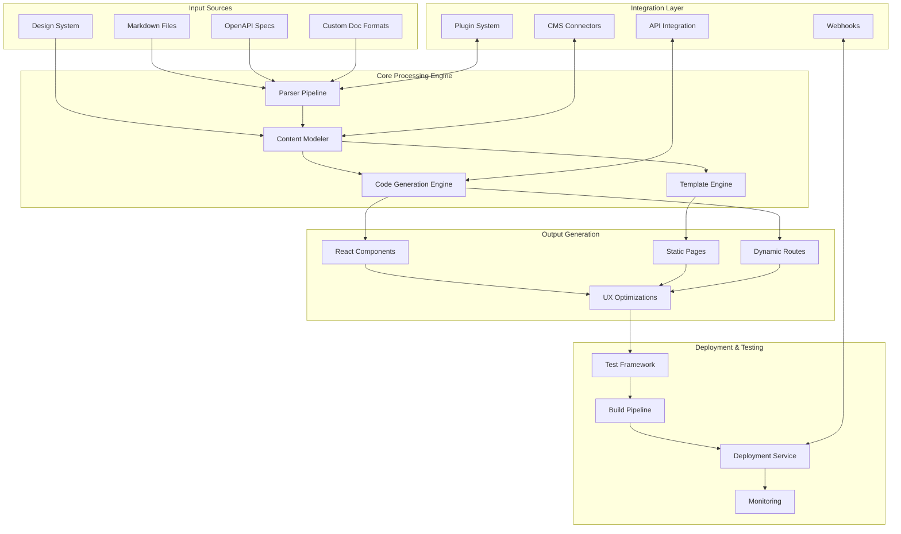

# Documentation-Driven Website Generator (DocSite)

I'll design a comprehensive system for automatically generating production-ready React websites from various documentation sources. Let's break this down into components, architecture, workflows, and implementation details.

## System Architecture Overview



## 1. Core Components & Modules

### Documentation Parser Service
- **Multi-format Parser**: Support for Markdown, OpenAPI, AsciiDoc, JSDoc, and custom formats
- **Schema Validator**: Ensures documentation meets required format specifications
- **Content Extractor**: Identifies key sections, code examples, and metadata
- **Plugin System**: Extends parsing capabilities for new documentation formats

### Content Modeling Engine
- **Entity Extraction**: Identifies entities, relationships, and hierarchical structures
- **Semantic Analysis**: Understands context and categorizes content appropriately
- **Structure Generator**: Creates logical site maps based on documentation organization
- **Content Normalization**: Transforms diverse sources into a unified representation

### Code Generation Service
- **Component Factory**: Generates React components from parsed content
- **Template Renderer**: Applies templates to content models
- **Style Injector**: Integrates with design systems to apply consistent styling
- **Code Optimizer**: Ensures generated code follows best practices

### UX Automation Module
- **Responsive Layout Generator**: Creates adaptive layouts for various devices
- **Accessibility Enhancer**: Ensures WCAG compliance
- **Performance Optimizer**: Implements lazy loading, code splitting, and bundle optimization
- **Navigation Builder**: Creates intuitive navigation structures

### Testing Orchestrator
- **Test Generator**: Creates appropriate tests based on generated components
- **Test Runner**: Executes unit, integration, and end-to-end tests
- **Validation Service**: Verifies rendered output matches documentation sources
- **Coverage Analyzer**: Ensures comprehensive test coverage

## 2. Implementation Plan

### Phase 1: Documentation Parser Development

```javascript
// Core parser factory with plugin architecture
class DocumentationParserFactory {
  constructor() {
    this.parsers = new Map();
    this.registerCoreFormats();
  }

  registerCoreFormats() {
    this.register('markdown', new MarkdownParser());
    this.register('openapi', new OpenAPIParser());
    this.register('jsdoc', new JSDocParser());
    this.register('custom', new CustomFormatParser());
  }

  register(format, parser) {
    this.parsers.set(format, parser);
    return this; // For method chaining
  }

  getParser(format) {
    const parser = this.parsers.get(format);
    if (!parser) {
      throw new Error(`No parser registered for format: ${format}`);
    }
    return parser;
  }

  async parse(source, format, options = {}) {
    const parser = this.getParser(format);
    return await parser.parse(source, options);
  }
}

// Example implementation of a Markdown parser
class MarkdownParser {
  constructor() {
    this.plugins = [];
  }

  use(plugin) {
    this.plugins.push(plugin);
    return this;
  }

  async parse(source, options = {}) {
    try {
      // Basic content parsing
      let ast = this.parseToAST(source);
      
      // Apply plugins for additional processing
      for (const plugin of this.plugins) {
        ast = await plugin.process(ast, options);
      }
      
      // Transform to normalized content model
      const contentModel = this.transformToContentModel(ast);
      
      // Extract metadata
      const metadata = this.extractMetadata(ast);
      
      return {
        contentModel,
        metadata,
        format: 'markdown',
        originalSource: source
      };
    } catch (error) {
      throw new Error(`Markdown parsing failed: ${error.message}`);
    }
  }

  parseToAST(source) {
    // Implementation would use a library like remark or marked
    // This is a simplified placeholder
    const sections = [];
    const lines = source.split('\n');
    
    let currentSection = null;
    
    for (const line of lines) {
      if (line.startsWith('# ')) {
        // New h1 section
        if (currentSection) {
          sections.push(currentSection);
        }
        currentSection = {
          type: 'section',
          title: line.substring(2),
          level: 1,
          content: []
        };
      } else if (currentSection) {
        currentSection.content.push(line);
      }
    }
    
    if (currentSection) {
      sections.push(currentSection);
    }
    
    return { type: 'document', sections };
  }

  transformToContentModel(ast) {
    // Transform AST to standardized content model
    // This would map markdown-specific structures to our unified model
    return {
      type: 'document',
      elements: ast.sections.map(section => ({
        type: 'section',
        title: section.title,
        level: section.level,
        content: this.processContent(section.content)
      }))
    };
  }

  processContent(contentLines) {
    // Process content lines into structured content elements
    // This is simplified; real implementation would be more comprehensive
    const elements = [];
    let codeBlock = null;
    let paragraph = null;

    for (const line of contentLines) {
      if (line.startsWith('```')) {
        if (codeBlock) {
          // End code block
          elements.push(codeBlock);
          codeBlock = null;
        } else {
          // Start code block
          const language = line.substring(3).trim();
          codeBlock = {
            type: 'code',
            language,
            content: []
          };
        }
      } else if (codeBlock) {
        codeBlock.content.push(line);
      } else if (line.trim() === '') {
        if (paragraph) {
          elements.push(paragraph);
          paragraph = null;
        }
      } else {
        if (!paragraph) {
          paragraph = {
            type: 'paragraph',
            content: []
          };
        }
        paragraph.content.push(line);
      }
    }

    // Add any remaining paragraph or code block
    if (paragraph) elements.push(paragraph);
    if (codeBlock) elements.push(codeBlock);

    return elements;
  }

  extractMetadata(ast) {
    // Extract common metadata patterns like frontmatter
    // Simplified implementation
    const metadata = {
      title: '',
      description: '',
      tags: []
    };

    if (ast.sections.length > 0) {
      metadata.title = ast.sections[0].title;
    }

    return metadata;
  }
}

// Similar implementations would exist for other parser types
class OpenAPIParser {
  async parse(source, options = {}) {
    // OpenAPI-specific parsing logic
    // Would convert OpenAPI specs to our common content model
  }
}

class JSDocParser {
  async parse(source, options = {}) {
    // JSDoc-specific parsing logic
  }
}

class CustomFormatParser {
  async parse(source, options = {}) {
    // Extensible parser for custom documentation formats
  }
}

// Example plugin for extracting API endpoints from markdown
class APIEndpointExtractorPlugin {
  async process(ast, options) {
    // Find and tag API endpoint descriptions in the AST
    // This would enhance the AST with API-specific metadata
    return ast;
  }
}

// Export the factory
module.exports = {
  DocumentationParserFactory,
  plugins: {
    APIEndpointExtractorPlugin
  }
};

```

### Phase 2: Content Modeling & Component Generation

```typescript
import { ContentModel, ComponentTemplate, DesignSystem } from './types';

// Core component generator
export class ComponentGenerator {
  private designSystem: DesignSystem;
  private templateRegistry: Map<string, ComponentTemplate>;
  
  constructor(designSystem: DesignSystem) {
    this.designSystem = designSystem;
    this.templateRegistry = new Map();
    this.registerDefaultTemplates();
  }
  
  private registerDefaultTemplates(): void {
    // Register built-in component templates
    this.registerTemplate('section', new SectionTemplate());
    this.registerTemplate('code-block', new CodeBlockTemplate());
    this.registerTemplate('api-endpoint', new APIEndpointTemplate());
    this.registerTemplate('table', new TableTemplate());
    this.registerTemplate('navigation', new NavigationTemplate());
  }
  
  public registerTemplate(type: string, template: ComponentTemplate): void {
    this.templateRegistry.set(type, template);
  }
  
  public async generateComponent(contentElement: any): Promise<string> {
    const elementType = contentElement.type;
    const template = this.templateRegistry.get(elementType);
    
    if (!template) {
      throw new Error(`No template registered for element type: ${elementType}`);
    }
    
    // Generate component based on content model and design system
    const componentCode = await template.generate(contentElement, this.designSystem);
    return this.applyDesignSystem(componentCode, elementType);
  }
  
  private applyDesignSystem(componentCode: string, elementType: string): string {
    // Apply design system styling and components
    const dsConfig = this.designSystem.getConfigForType(elementType);
    
    // Replace placeholder classes with design system classes
    let styledCode = componentCode;
    for (const [placeholder, actualClass] of Object.entries(dsConfig.classMapping)) {
      styledCode = styledCode.replace(
        new RegExp(`{${placeholder}}`, 'g'),
        actualClass as string
      );
    }
    
    // Add design system imports if needed
    const imports = this.generateImports(dsConfig.components);
    
    return `${imports}\n\n${styledCode}`;
  }
  
  private generateImports(components: string[]): string {
    if (components.length === 0) return '';
    
    const importSource = this.designSystem.importPath;
    return `import { ${components.join(', ')} } from '${importSource}';`;
  }
  
  public async generatePage(contentModel: ContentModel): Promise<string> {
    const components: string[] = [];
    
    // Generate individual components
    for (const element of contentModel.elements) {
      const component = await this.generateComponent(element);
      components.push(component);
    }
    
    // Combine into page component
    return this.assemblePage(components, contentModel.metadata);
  }
  
  private assemblePage(components: string[], metadata: any): string {
    const pageTitle = metadata.title || 'Generated Page';
    const imports = this.generatePageImports();
    
    return `
${imports}

export default function ${this.sanitizeComponentName(pageTitle)}() {
  return (
    <div className={${this.designSystem.classNames.pageContainer}}>
      ${components.join('\n      ')}
    </div>
  );
}
`;
  }
  
  private generatePageImports(): string {
    const baseImports = `import React from 'react';`;
    const dsImports = `import { ${this.designSystem.pageComponents.join(', ')} } from '${this.designSystem.importPath}';`;
    
    return `${baseImports}\n${dsImports}`;
  }
  
  private sanitizeComponentName(name: string): string {
    // Convert page title to valid component name
    return name
      .replace(/[^a-zA-Z0-9]/g, '')
      .replace(/^[0-9]/, 'Page');
  }
}

// Template implementations
class SectionTemplate implements ComponentTemplate {
  async generate(element: any, designSystem: DesignSystem): Promise<string> {
    const { title, level, content } = element;
    
    // Determine heading level
    const HeadingTag = `h${level}`;
    
    return `
<section className="{section-container}">
  <${HeadingTag} className="{heading-${level}}">${title}</${HeadingTag}>
  <div className="{content-container}">
    ${this.renderContent(content, designSystem)}
  </div>
</section>
`;
  }
  
  private renderContent(content: any[], designSystem: DesignSystem): string {
    // Implementation would render different content types
    return content.map(item => {
      if (item.type === 'paragraph') {
        return `<p className="{paragraph}">${item.content.join(' ')}</p>`;
      }
      // Handle other content types
      return '';
    }).join('\n    ');
  }
}

class CodeBlockTemplate implements ComponentTemplate {
  async generate(element: any, designSystem: DesignSystem): Promise<string> {
    const { language, content } = element;
    
    return `
<div className="{code-block-container}">
  <div className="{code-block-header}">
    <span className="{code-language-badge}">${language}</span>
  </div>
  <pre className="{code-pre}">
    <code className="{code} {code-${language}}">
      ${this.escapeCode(content.join('\n'))}
    </code>
  </pre>
</div>
`;
  }
  
  private escapeCode(code: string): string {
    // Escape HTML special characters
    return code
      .replace(/&/g, '&amp;')
      .replace(/</g, '&lt;')
      .replace(/>/g, '&gt;')
      .replace(/"/g, '&quot;')
      .replace(/'/g, '&#039;');
  }
}

class APIEndpointTemplate implements ComponentTemplate {
  async generate(element: any, designSystem: DesignSystem): Promise<string> {
    const { method, endpoint, parameters, responses } = element;
    
    return `
<div className="{api-endpoint-container}">
  <div className="{endpoint-header} {method-${method.toLowerCase()}}">
    <span className="{http-method}">${method}</span>
    <span className="{endpoint-path}">${endpoint}</span>
  </div>
  <div className="{endpoint-body}">
    ${this.renderParameters(parameters)}
    ${this.renderResponses(responses)}
  </div>
</div>
`;
  }
  
  private renderParameters(parameters: any[]): string {
    if (!parameters || parameters.length === 0) {
      return '';
    }
    
    return `
    <div className="{parameters-section}">
      <h4 className="{section-title}">Parameters</h4>
      <table className="{parameters-table}">
        <thead>
          <tr>
            <th>Name</th>
            <th>Type</th>
            <th>Description</th>
            <th>Required</th>
          </tr>
        </thead>
        <tbody>
          ${parameters.map(param => `
          <tr>
            <td>${param.name}</td>
            <td>${param.type}</td>
            <td>${param.description}</td>
            <td>${param.required ? 'Yes' : 'No'}</td>
          </tr>
          `).join('')}
        </tbody>
      </table>
    </div>
    `;
  }
  
  private renderResponses(responses: any): string {
    if (!responses || Object.keys(responses).length === 0) {
      return '';
    }
    
    return `
    <div className="{responses-section}">
      <h4 className="{section-title}">Responses</h4>
      <div className="{responses-container}">
        ${Object.entries(responses).map(([code, response]: [string, any]) => `
        <div className="{response-item} {response-${this.getResponseClass(code)}}">
          <div className="{response-code}">${code}</div>
          <div className="{response-description}">${response.description}</div>
        </div>
        `).join('')}
      </div>
    </div>
    `;
  }
  
  private getResponseClass(code: string): string {
    const codeNum = parseInt(code, 10);
    if (codeNum < 300) return 'success';
    if (codeNum < 400) return 'redirect';
    if (codeNum < 500) return 'client-error';
    return 'server-error';
  }
}

class TableTemplate implements ComponentTemplate {
  async generate(element: any, designSystem: DesignSystem): Promise<string> {
    const { headers, rows } = element;
    
    return `
<div className="{table-container}">
  <table className="{table}">
    <thead>
      <tr>
        ${headers.map((header: string) => `<th className="{table-header}">${header}</th>`).join('\n        ')}
      </tr>
    </thead>
    <tbody>
      ${rows.map((row: string[]) => `
      <tr className="{table-row}">
        ${row.map((cell: string) => `<td className="{table-cell}">${cell}</td>`).join('\n        ')}
      </tr>
      `).join('\n      ')}
    </tbody>
  </table>
</div>
`;
  }
}

class NavigationTemplate implements ComponentTemplate {
  async generate(element: any, designSystem: DesignSystem): Promise<string> {
    const { items } = element;
    
    return `
<nav className="{navigation-container}">
  <ul className="{nav-list}">
    ${items.map((item: any) => `
    <li className="{nav-item}">
      <a href="${item.path}" className="{nav-link}${item.active ? ' {nav-link-active}' : ''}">
        ${item.label}
      </a>
      ${item.children ? this.renderSubItems(item.children) : ''}
    </li>
    `).join('\n    ')}
  </ul>
</nav>
`;
  }
  
  private renderSubItems(items: any[]): string {
    return `
    <ul className="{nav-sublist}">
      ${items.map((item: any) => `
      <li className="{nav-subitem}">
        <a href="${item.path}" className="{nav-sublink}${item.active ? ' {nav-sublink-active}' : ''}">
          ${item.label}
        </a>
      </li>
      `).join('\n      ')}
    </ul>
    `;
  }
}

// Type definitions would be in a separate file
// This is for illustration purposes
interface ComponentTemplate {
  generate(element: any, designSystem: DesignSystem): Promise<string>;
}

```

### Phase 3: Design System Integration

```typescript
import { Theme, StyleMapping } from './types';

/**
 * DesignSystemAdapter provides a unified interface for working with
 * different design systems (Material-UI, Tailwind, custom, etc.)
 */
export class DesignSystemAdapter {
  private designSystem: string;
  private config: any;
  private componentMap: Map<string, any>;
  private styleMap: StyleMapping;
  
  constructor(designSystemName: string, config: any) {
    this.designSystem = designSystemName;
    this.config = config;
    this.componentMap = new Map();
    this.styleMap = {};
    
    this.initialize();
  }
  
  private initialize(): void {
    switch (this.designSystem) {
      case 'material-ui':
        this.initializeMaterialUI();
        break;
      case 'tailwind':
        this.initializeTailwind();
        break;
      case 'bootstrap':
        this.initializeBootstrap();
        break;
      case 'custom':
        this.initializeCustom();
        break;
      default:
        throw new Error(`Unsupported design system: ${this.designSystem}`);
    }
  }
  
  private initializeMaterialUI(): void {
    // Map common component patterns to Material-UI components
    this.componentMap.set('Button', 'Button');
    this.componentMap.set('Card', 'Card');
    this.componentMap.set('Typography', 'Typography');
    this.componentMap.set('TextField', 'TextField');
    this.componentMap.set('List', 'List');
    this.componentMap.set('ListItem', 'ListItem');
    this.componentMap.set('Table', 'Table');
    this.componentMap.set('TableHead', 'TableHead');
    this.componentMap.set('TableBody', 'TableBody');
    this.componentMap.set('TableRow', 'TableRow');
    this.componentMap.set('TableCell', 'TableCell');
    
    // Map style placeholders to Material-UI specific classes/props
    this.styleMap = {
      'heading-1': 'variant="h1"',
      'heading-2': 'variant="h2"',
      'heading-3': 'variant="h3"',
      'paragraph': 'variant="body1"',
      'section-container': 'className="MuiSection"',
      'code-block-container': 'className="MuiPaper" elevation={2}',
      'table-container': 'className="MuiTableContainer"',
      'nav-list': 'component="nav"',
      // Additional mappings would be defined here
    };
  }
  
  private initializeTailwind(): void {
    // With Tailwind, we're mostly mapping to CSS classes
    this.styleMap = {
      'heading-1': 'text-4xl font-bold mb-4',
      'heading-2': 'text-3xl font-bold mb-3',
      'heading-3': 'text-2xl font-bold mb-2',
      'paragraph': 'text-base mb-4',
      'section-container': 'py-6',
      'code-block-container': 'bg-gray-800 rounded-lg overflow-hidden mb-6',
      'code-block-header': 'bg-gray-700 px-4 py-2 flex items-center',
      'code-language-badge': 'text-xs text-white bg-gray-600 px-2 py-1 rounded',
      'code-pre': 'p-4 overflow-auto',
      'code': 'text-white',
      'table-container': 'overflow-x-auto',
      'table': 'min-w-full bg-white',
      'table-header': 'bg-gray-100 border-b px-6 py-3 text-left text-xs font-medium text-gray-500 uppercase tracking-wider',
      'table-row': 'border-b hover:bg-gray-50',
      'table-cell': 'px-6 py-4 whitespace-nowrap text-sm text-gray-500',
      'nav-list': 'flex flex-col space-y-2',
      'nav-item': 'text-gray-700',
      'nav-link': 'hover:text-blue-600 px-2 py-1 rounded hover:bg-gray-100',
      'nav-link-active': 'text-blue-600 font-medium bg-blue-50',
      // Many more mappings would be included
    };
  }
  
  private initializeBootstrap(): void {
    // Bootstrap class mappings
    this.styleMap = {
      'heading-1': 'h1',
      'heading-2': 'h2',
      'heading-3': 'h3',
      'paragraph': '',
      'section-container': 'mb-4',
      'code-block-container': 'card mb-4',
      'code-block-header': 'card-header bg-light d-flex',
      'code-language-badge': 'badge bg-secondary',
      'code-pre': 'card-body p-0',
      'code': 'p-3',
      'table-container': 'table-responsive',
      'table': 'table table-striped',
      'table-header': '',
      'table-row': '',
      'table-cell': '',
      'nav-list': 'nav flex-column',
      'nav-item': 'nav-item',
      'nav-link': 'nav-link',
      'nav-link-active': 'active',
      // Additional mappings
    };
  }
  
  private initializeCustom(): void {
    // Initialize with custom configuration
    if (this.config.componentMap) {
      for (const [key, value] of Object.entries(this.config.componentMap)) {
        this.componentMap.set(key, value);
      }
    }
    
    if (this.config.styleMap) {
      this.styleMap = this.config.styleMap;
    }
  }
  
  public getComponentName(abstractComponent: string): string {
    return this.componentMap.get(abstractComponent) || abstractComponent;
  }
  
  public getStyleForElement(elementType: string): string {
    return this.styleMap[elementType] || '';
  }
  
  public getImportStatement(): string {
    switch (this.designSystem) {
      case 'material-ui':
        return `import { ${Array.from(this.componentMap.values()).join(', ')} } from '@material-ui/core';`;
      case 'tailwind':
        // Tailwind doesn't require component imports, just the CSS
        return '';
      case 'bootstrap':
        // Bootstrap may require component imports depending on the React implementation
        return `import 'bootstrap/dist/css/bootstrap.min.css';`;
      case 'custom':
        return this.config.importStatement || '';
      default:
        return '';
    }
  }
  
  public applyTheme(theme: Theme): void {
    // Apply theme customizations
    if (theme.colors) {
      // Implementation depends on design system
      switch (this.designSystem) {
        case 'material-ui':
          // Would use createTheme from MUI
          break;
        case 'tailwind':
          // Would modify tailwind config
          break;
        // Other cases
      }
    }
  }
  
  public getComponentPropsForType(elementType: string, properties: any = {}): string {
    // Generate the right props based on design system
    const baseStyle = this.getStyleForElement(elementType);
    
    // Combine with custom properties
    const customProps = Object.entries(properties)
      .map(([key, value]) => `${key}="${value}"`)
      .join(' ');
    
    return `${baseStyle} ${customProps}`.trim();
  }
  
  // Additional utility methods for specific design system features
}

```

### Phase 4: CMS Integration & Template Management

```typescript
import axios from 'axios';
import { CMSConfig, ContentModel, PageTemplate } from './types';

/**
 * CMSIntegrationService handles connecting to various CMS systems
 * and synchronizing content between the CMS and generated website
 */
export class CMSIntegrationService {
  private cmsType: string;
  private config: CMSConfig;
  private client: any;
  private templateRegistry: Map<string, PageTemplate>;
  
  constructor(cmsType: string, config: CMSConfig) {
    this.cmsType = cmsType;
    this.config = config;
    this.templateRegistry = new Map();
    
    this.initialize();
  }
  
  private initialize(): void {
    // Set up CMS client based on type
    switch (this.cmsType) {
      case 'contentful':
        this.initializeContentful();
        break;
      case 'strapi':
        this.initializeStrapi();
        break;
      case 'sanity':
        this.initializeSanity();
        break;
      case 'custom':
        this.initializeCustomCMS();
        break;
      default:
        throw new Error(`Unsupported CMS type: ${this.cmsType}`);
    }
    
    // Register default templates
    this.registerDefaultTemplates();
  }
  
  private initializeContentful(): void {
    // Initialize Contentful client
    const { spaceId, accessToken, environment = 'master' } = this.config;
    
    if (!spaceId || !accessToken) {
      throw new Error('Contentful integration requires spaceId and accessToken');
    }
    
    // Would use contentful.js in actual implementation
    this.client = {
      spaceId,
      accessToken,
      environment,
      // Mock methods for illustration
      getEntries: async (query: any) => {
        return axios.get(
          `https://cdn.contentful.com/spaces/${spaceId}/environments/${environment}/entries`,
          {
            headers: {
              Authorization: `Bearer ${accessToken}`
            },
            params: query
          }
        ).then(response => response.data);
      }
    };
  }
  
  private initializeStrapi(): void {
    // Initialize Strapi client
    const { apiUrl, apiToken } = this.config;
    
    if (!apiUrl) {
      throw new Error('Strapi integration requires apiUrl');
    }
    
    // Simple client using axios
    this.client = {
      apiUrl,
      apiToken,
      // Mock methods for illustration
      getEntries: async (contentType: string, query: any = {}) => {
        return axios.get(
          `${apiUrl}/api/${contentType}`,
          {
            headers: apiToken ? {
              Authorization: `Bearer ${apiToken}`
            } : {},
            params: query
          }
        ).then(response => response.data);
      }
    };
  }
  
  private initializeSanity(): void {
    // Initialize Sanity client
    const { projectId, dataset, token } = this.config;
    
    if (!projectId || !dataset) {
      throw new Error('Sanity integration requires projectId and dataset');
    }
    
    // Would use @sanity/client in actual implementation
    this.client = {
      projectId,
      dataset,
      token,
      useCdn: true
    };
  }
  
  private initializeCustomC
```