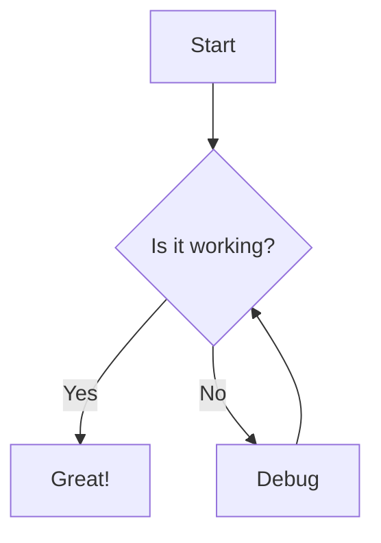

# Docsify Site Generator

[](https://github.com/username/site-generator/actions/workflows/ci.yml)
[](https://www.npmjs.com/package/docsify-site-generator)
[](https://opensource.org/licenses/MIT)

A powerful documentation-driven website generator with Docsify integration. This tool converts Markdown documentation into a beautiful React website with features like:

- **Markdown Parsing**: Support for advanced Markdown features
- **Mermaid Diagrams**: Render diagrams from Markdown code blocks
- **Cross-References**: Easy linking between documents
- **Syntax Highlighting**: Beautiful code highlighting with Prism
- **Automatic Navigation**: Generate navigation from your directory structure
- **Theme Support**: Multiple themes to choose from

## Installation

```bash
npm install docsify-site-generator
```

## Usage

### Command Line

```bash
npx site-generator --source ./docs --output ./dist --theme vue
```

Options:

- `--source, -s`: Source directory (default: current directory)
- `--output, -o`: Output directory (default: ./dist)
- `--theme, -t`: Theme to use (default: vue)
- `--ignore, -i`: Comma-separated list of directories to ignore
- `--help, -h`: Show help message

Available themes:

- `vue`: Vue theme (default)
- `dark`: Dark theme
- `buble`: Buble theme
- `pure`: Pure theme
- `dolphin`: Dolphin theme

### Programmatic Usage

```javascript
const { DocsifyWebsiteGenerator } = require('docsify-site-generator');

const generator = new DocsifyWebsiteGenerator({
  sourceDir: './docs',
  outputDir: './dist',
  designSystem: {
    name: 'vue',
  },
});

generator
  .generate()
  .then(() => {
    console.log('Website generated successfully!');
  })
  .catch(error => {
    console.error('Error generating website:', error);
  });
```

## Features

### Markdown Support

The generator supports standard Markdown syntax plus:

- Front matter for metadata
- Code blocks with syntax highlighting
- Tables
- Task lists
- Footnotes

### Mermaid Diagrams

Create diagrams using Mermaid syntax:

````markdown

````

### Cross-References

Link to other documents using the cross-reference syntax:

```markdown
Check out the [[path/to/file|link text]] for more information.
```

### Directory Structure

The generator automatically creates navigation based on your directory structure:

```text
docs/
├── README.md
├── getting-started.md
├── features/
│   ├── README.md
│   ├── markdown.md
│   └── diagrams.md
└── api/
    ├── README.md
    └── reference.md
```

## Customization

### Themes

Choose from multiple built-in themes or create your own:

```bash
npx site-generator --theme dark
```

### Plugins

The generator includes several plugins:

- **MermaidPlugin**: Renders Mermaid diagrams
- **CrossReferencePlugin**: Processes cross-references
- **PrismPlugin**: Adds syntax highlighting

## Contributing

Contributions are welcome! Please check out our [Contributing Guide](CONTRIBUTING.md) for details on how to get started.

### Development

```bash
# Clone the repository
git clone https://github.com/username/site-generator.git
cd site-generator

# Install dependencies
npm install

# Build the project
npm run build

# Run tests
npm test
```

## Examples

Check out the [examples](examples/) directory for sample projects that demonstrate how to use the Site Generator.

## Changelog

See the [CHANGELOG.md](CHANGELOG.md) file for details on version history and updates.

## Recent Updates

### TypeScript Fixes

We've recently fixed several TypeScript compilation errors in the codebase. These fixes include:

- Fixed import path extensions
- Resolved module import issues
- Added proper type assertions for unknown types
- Added null checks for potentially undefined properties
- Fixed duplicate property specifications

For more details, see the [TypeScript Fixes Documentation](docs/typescript-fixes.md).

## License

This project is licensed under the MIT License - see the [LICENSE](LICENSE) file for details.
