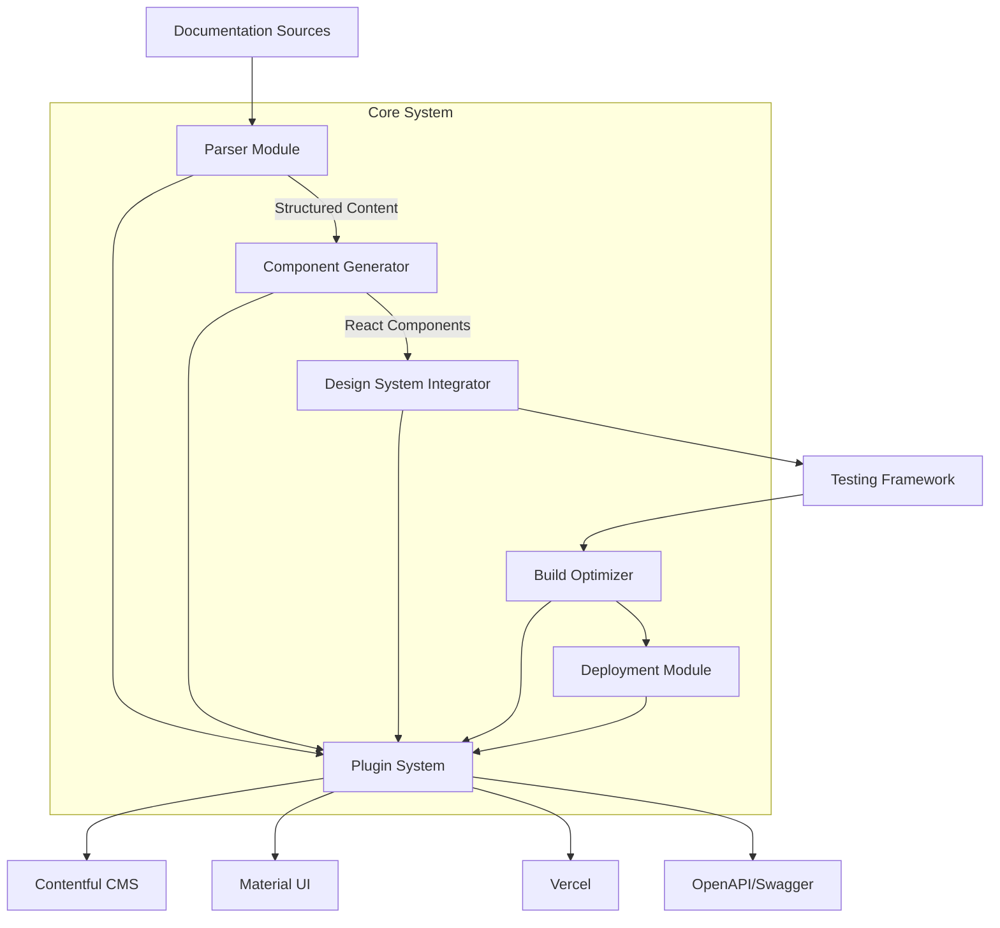
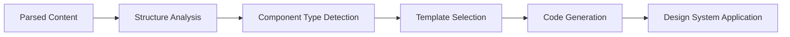
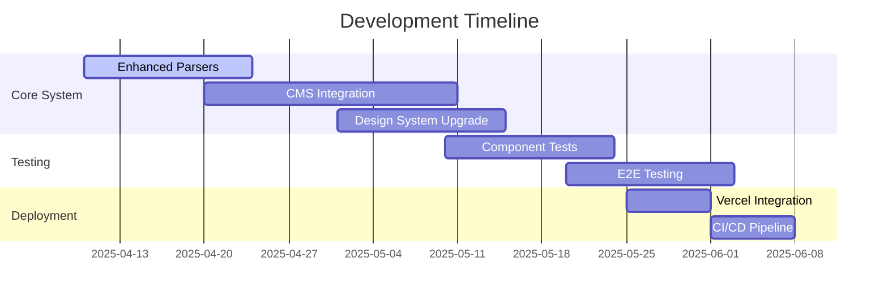

# Automated React Website Generation System Implementation Plan

## 1. System Architecture

## 2. Implementation Phases

### Phase 1: Enhanced Documentation Parsing (2 Weeks)

- Implement OpenAPI/Swagger parser
- Develop Contentful CMS integration plugin
- Add ML-based content analysis algorithms
- Create unified content model for multi-format support

### Phase 2: Component Generation (3 Weeks)

### Phase 3: Design System Integration (2 Weeks)

- Material UI theme configuration system
- Dynamic component variant generator
- Accessibility audit pipeline (WCAG 2.1 compliance)

### Phase 4: Testing Infrastructure (3 Weeks)

- Component snapshot testing
- Visual regression testing
- API contract validation
- CI/CD pipeline implementation

### Phase 5: Deployment System (1 Week)

- Vercel deployment automation
- Incremental static regeneration
- Performance optimization suite

## 3. Technical Specifications

### Key Components

| Component            | Purpose                     | Tech Stack                       |
| -------------------- | --------------------------- | -------------------------------- |
| CMSIntegrationModule | Contentful content fetching | TypeScript, Contentful SDK       |
| OpenAPIParser        | API doc processing          | OpenAPI 3.0, Swagger UI          |
| A11yValidator        | Accessibility checks        | axe-core, Lighthouse             |
| VercelDeployer       | Deployment automation       | Vercel CLI, Serverless Functions |

## 4. Roadmap

## 5. Quality Assurance

- Automated code reviews via ESLint/Prettier
- Performance budgets for core web vitals
- Rollback strategy for deployment failures
