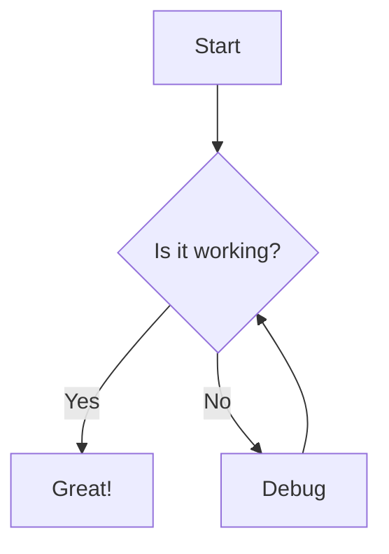

# Usage Guide

This guide explains how to use the Docsify Site Generator to convert your Markdown documentation into a beautiful React website.

## Getting Started

### Installation

Install the generator globally:

```bash
npm install -g docsify-site-generator
```

Or use it directly with npx:

```bash
npx docsify-site-generator
```

### Basic Usage

Generate a website from your documentation:

```bash
site-generator --source ./docs --output ./dist
```

This will:
1. Read all Markdown files in the `./docs` directory
2. Generate a React website
3. Output the website to the `./dist` directory

### Command Line Options

The generator supports several command line options:

- `--source, -s`: Source directory (default: current directory)
- `--output, -o`: Output directory (default: ./dist)
- `--theme, -t`: Theme to use (default: vue)
- `--ignore, -i`: Comma-separated list of directories to ignore
- `--help, -h`: Show help message

Example:

```bash
site-generator --source ./docs --output ./dist --theme dark --ignore node_modules,temp
```

## Document Structure

### Directory Organization

The generator uses your directory structure to create navigation:

```
docs/
├── README.md              # Home page
├── getting-started.md     # Getting Started page
├── features/              # Features section
│   ├── README.md          # Features overview page
│   ├── markdown.md        # Markdown features page
│   └── diagrams.md        # Diagrams page
└── api/                   # API section
    ├── README.md          # API overview page
    └── reference.md       # API reference page
```

### Front Matter

You can add metadata to your Markdown files using front matter:

```markdown
---
title: Getting Started
description: Learn how to get started with our product
---

# Getting Started

This guide will help you get started...
```

## Markdown Features

### Basic Syntax

The generator supports standard Markdown syntax:

```markdown
# Heading 1
## Heading 2

Paragraph with **bold** and *italic* text.

- List item 1
- List item 2

1. Numbered item 1
2. Numbered item 2

> Blockquote

[Link text](https://example.com)


```

### Code Blocks

Code blocks with syntax highlighting:

````markdown
```javascript
function hello() {
  console.log('Hello, world!');
}
```
````

### Tables

Tables are supported:

```markdown
| Name  | Type    | Description       |
|-------|---------|-------------------|
| id    | string  | Unique identifier |
| title | string  | Item title        |
| count | number  | Item count        |
```

### Task Lists

Task lists for to-do items:

```markdown
- [x] Completed task
- [ ] Incomplete task
```

## Advanced Features

### Mermaid Diagrams

Create diagrams using Mermaid syntax:

````markdown

````

### Cross-References

Link to other documents using the cross-reference syntax:

```markdown
Check out the [[path/to/file|link text]] for more information.
```

This will be converted to a proper link in the generated website.

## Themes

The generator includes several built-in themes:

- `vue`: Vue theme (default)
- `dark`: Dark theme
- `buble`: Buble theme
- `pure`: Pure theme
- `dolphin`: Dolphin theme

To use a different theme:

```bash
site-generator --theme dark
```

## Customization

### Custom CSS

You can add custom CSS by creating a `theme.css` file in your source directory.

### Custom Components

For advanced customization, you can create custom React components and integrate them with the generator.

## Troubleshooting

### Common Issues

- **Missing dependencies**: Make sure you have all required dependencies installed
- **File not found**: Check that your source directory exists and contains Markdown files
- **Parse errors**: Verify that your Markdown syntax is correct

### Getting Help

If you encounter any issues, please:

1. Check the documentation
2. Look for similar issues in the GitHub repository
3. Open a new issue if needed
