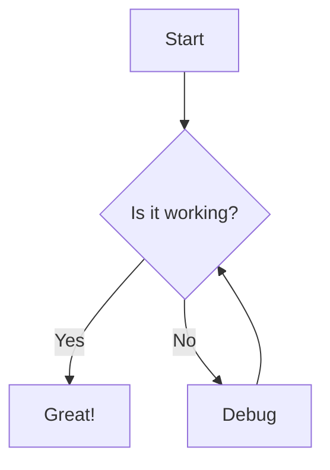

# Basic Example

This is a basic example of using the Site Generator.

## Getting Started

1. Install dependencies:
   ```bash
   npm install
   ```

2. Run the generator:
   ```bash
   npx site-generator --source ./docs --output ./dist
   ```

## Features Demonstrated

- Basic Markdown parsing
- Automatic navigation generation
- Theme application
- Mermaid diagram rendering

## Mermaid Diagram Example



## Cross-Reference Example

Check out the [[features|Features]] page for more information.
